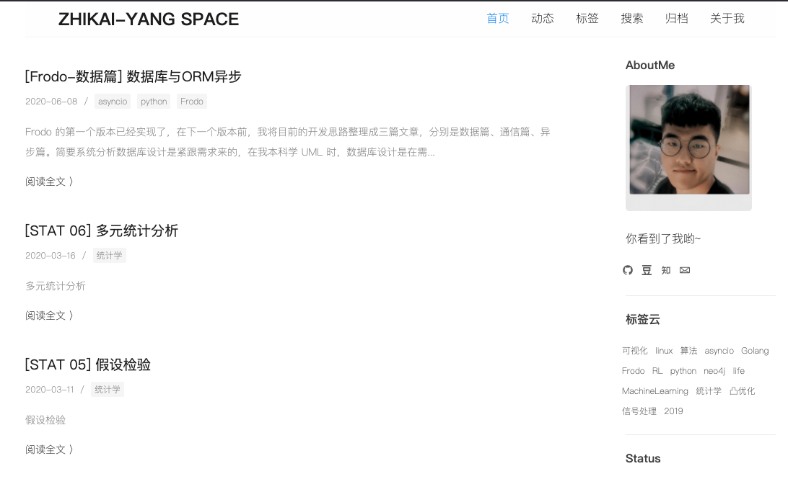
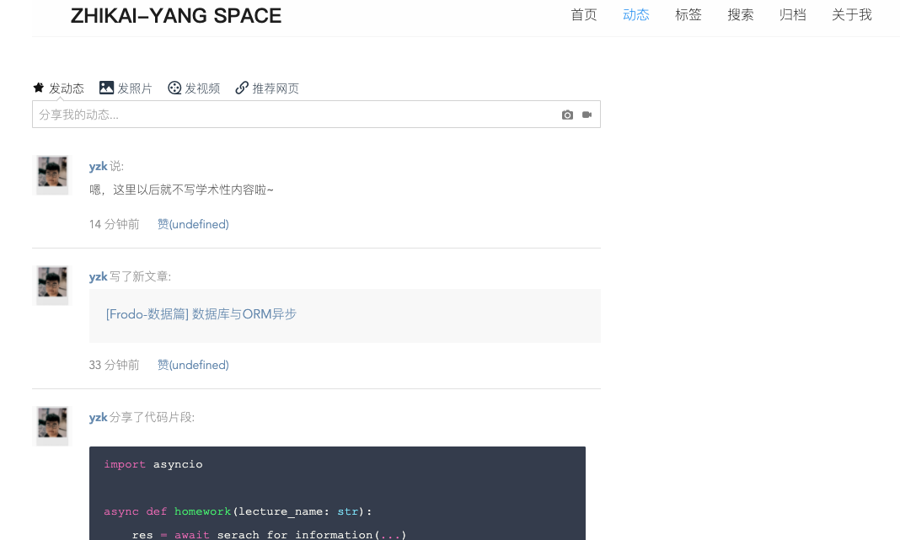

[zh-中文](readme_cn.md)

# Frodo V2.0


Frodo is a personal blog using python and golang's **asynchronous** technique.

[Document(only Chinese now and Eng version will be soon)~](http://zhikai.pro/html/index.html)

## Overview

v2.0 add new language golang to rebuild the `admin` module's api, blog's front end page is still rendered by python.

### techniques selection

Frodo's technique selection is as follows:

- Blog Page Web Framework：`python/fastapi`
- Page ORM: `sqlalchemy` + `encode/databases` (as FastAPI recommends)
- Page Templates: `Mako/FastAPI-Mako`
- python async web service: `asgi/uvicorn`
- Admin Web Framework: `golang/gin`
- Addmin ORM: `gorm`
- Admin UI: [vue-element-admin](https://github.com/PanJiaChen/vue-element-admin)
- KV database: `redis`
- cached: `redis/memcached`
- reverse web proxy: `nginx`
- data persistence: `mysql`
- database migration: `alembic`
- authentication: `JWT`
- python type hints: `pydantic`

### features

- Admin platform supports posts, users and topics Create, Read, Update, Delete (CRUD)
- Admin posts editor suport preview and markdown
- Page supports programming lang highlights, Latex Math equations and TOC.
- Blog has posts global searching
- Visitors' react and comments based on Github Auth
- Batch posts in markdown or HEXO exportation
- Customize your persion partail diplay
- Activities like twitter
- Docker deploments

### why fastapi?

`fastapi` is a python web framework gathering features of flask, django. It supports both asynchronous checkpoints and normal blog ways. Using `uvicorn` to support eventloop make fastapi faster. More excellent feature is the pydantic and data scheme, encouraging to follow the OpenAPI rules, the `swagger-docs` will be generated automatically.

### why golang?

golang是年轻的语言，设计理念很好地平衡了`C++`和 `javascript/python`等动态语言的优劣，独具特色的`goroutine`设计范式旨在告别多线程式的并发。而web后台和微服务是go语言用的的最多的领域，故我将后台纯api部分拿go来重写。

python service use asynchornous asyncio ecosystem. Golang supports asynchronous primitively. `goroutine` is like python's corouine can be controlled by eventloop. Admin's api is very easy to rebuilt via golang.

### 效果：
Admin paltform：


Blog Pages：



Activity：




## Setup

### Docker deployment (Recommends!)
The following are based on `docker-compose-1.25.5`, `MacOS-Majave 15.15` version.

Other verion could be fine as well (not tested!)

#### Modify the config
`python_web/config/config.ini.model` and `goadmin/config.ini.model`,

```
[global]
debug = True
author = yzk
site_title = Zhikai-Yang Space
host_path = 202.117.47.47:9080 ## alter this to your web port, like localhost for example
```
The rest configuration is every service's port, if some port are not accessed, please modify the corresponding config in `nginx.conf`, `docker-compose.yml`.

#### build images

```
git clone https://github.com/LouisYZK/Frodo
cd Frodo
sh build.sh
```
There are two web images(python and golang) should be built for a while, if there are some errors about network, you can rebuild it.

#### Start
```
docker-compose up ## start the whole servcie
```

It will start five service in docker-compose in some order:

- mysql
- redis
- python_web
- golang_web
- nginx

You can use `docker-compose ps ` to see wether all service are initailizaed correctly, if some service's status are `Exited` or other errors, please check the start logs and figure out the failure reasons. 

Please issue me if the errors are about the program itself!

#### Usage 
If start successfully, you should create an admin user firstly:

```
docker exec -it $(docker ps | grep frodo/pyweb | awk '{print $1}') python manager.py adduser
```
confirm the usernam and password according to the hints

接下来请访问`<host_ip>:<nginx_server_port>/admin`, 例如本机环境访问`localhost:9080/admin`, 用你刚才创建的账密登录，即可进入后台。

then, you can visit `<host_ip>:<nginx_server_port>/admin`, for example `localhost:9080/admin` on local PC. Using the accounts you've just created to enter the admin platform.

You can creating some posts for test, and visit `localhost:9080` to see its performance.

User's custome partial config is in `python_web/config.yaml`, modify it and it will work without docker-compose restartinf.


#### Environment Test
There are some os already testing without errors

- [x] Ubuntu LTS 16.06
- [x] MacOS Majave 15
- [ ] Windows ...
- [ ] Rowsberry ARM ...

Welcom to deploy Frodo on your device!~ And issue me for any problems!~


## For developers
The api docs are generated automically in `:/docs`, it can be tested directly. 

I'm sorry that developing documents only in Chinese version currently.


  