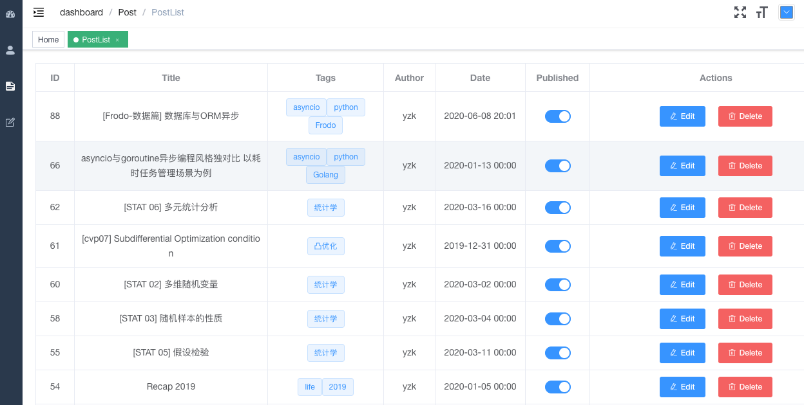

# Frodo V2.0


Asynchronoys Personal Blog via FastAPI and Golang/gin

[查看文档~](http://zhikai.pro/html/index.html)

## Overview
相较于v1.0，新版本加入了新语言和框架`Golang/gin`, 使用go语言重写了`admin`后台模块用到的api，前台依旧由python的框架支持。

### why fastapi?

2019年初开始，`Fastapi` 差不多成为了python届的网红，这个号称使用了异步、最快、集各大框架之有点于一身的框架需要实践检验。 不得不说他的文档写的很迷人，除了名字中体现的性能优势外，他集合了`Flask`, `Django` 中的很多特点，又直接以restful时代下的`OpenAPI`为默认接口标准。自带集成`swagger-docs` 不论是前端或是后端调试起来都很方便。

### why golang?

golang是年轻的语言，设计理念很好地平衡了`C++`和 `javascript/python`等动态语言的优劣，独具特色的`goroutine`设计范式旨在告别多线程式的并发。而web后台和微服务是go语言用的的最多的领域，故我将后台纯api部分拿go来重写。

### techniques selection

`Frodo`是一个使用了`python/golang` 异步生态开发的个人博客，使用的技术栈如下：

- 博客页面Web框架：python/fastapi
- 前台ORM: sqlalchemy + 异步 databases (FastAPI 推荐做法)
- 前台模板: Mako/FastAPI-Mako
- python web服务: asgi/uvicorn
- 后台Web框架: golang/gin
- 后台ORM: gorm
- 后台UI: [vue-element-admin](https://github.com/PanJiaChen/vue-element-admin)
- KV数据库: redis
- 缓存: redis/memcached
- 反向代理: nginx
- 持久化: mysql
- 数据库迁移: alembic
- 认证 JWT
- python类型检查: pydantic

### features
- 配套后台实现对文章、用户等的增删改查。
- 后台支持 markdown 预览与编辑
- 前端语法高亮、LaTeX 数学公式渲染、目录生成
- 支持文章搜索（模糊）
- 支持 Github 登录进行评论和反馈
- 支持 Hexo 或其他源 mardown 文章批量导入
- 支持个人设置（头像与介绍）
- 定制化导航栏，可以自行定义 page
- 支持文章中渲染 github-cards
- 支持个人「动态」类似知乎想法
- 支持Dokcer跨平台部署

### 效果：
后台内容管理系统：



博客页面：


动态页面：


## 如何使用？
### 本地部署
依赖要求
- python >=3.7
- golang >=1.10
- nginx
- mysql
- redis
- Unbuntu/MacOS (Windows请看Docker版本部署)

clone项目
```bash
git clone https://github.com/LouisYZK/Frodo
```
创建并进入python虚拟环境，请使用本地任意大于3.7版本的python创建
```
cd Frodo
python -m venv venv
source ./venv/bin/activate
pip install -r requirements.txt
```
如果没有安装virtualenv 先pip安装
```
pip install virtualenv
```
修改数据库配置，初始化数据库。(确保mysql与redis都已运行)

修改config/config.ini.model
```
username = 
password = 
port = 3306
db = fast_blog
charset = utf8
```
然后运行脚本使用alembic 创建表与迁移
```
bash migrate.sh
```
然后创建你的用户
```
python manage.py adduser
```
根据提示输入用户名密码等就ok

配置后台
```
cd goadmin
go mod init goadmin
```
如果报错请检查go语言是否安装成功。启动web：

```
bash start.sh
```
如果没报错则python和golang的服务都启动了，此时访问python的端口即可看到界面。

如果要在服务器部署，请修改`config.ini.model`的端口和`host_path`项。同时如需要反向代理同时修改nginx配置`nginx.conf`。

成功启动后（输出信息不报错），首先访问`localhost:8004/admin` 登进管理后台创建几篇文章。或使用
```
python manage.py hexo_export.py --dir xx --uname
```
进行markdown文章的批量导入。随后访问`localhost:8004`正常的话可以看到界面。

`动态功能` 需要先去`admin`下登录，然后动态页面才会出现发送动态的输入表单。

此外，`localhost:8001/docs` 是项目所有的API文档和调试入口，这是`fastapi`自动生成的，如果你在开发时严格执行`OpenAPI` 规范，那么这份文档可以直接输出供他人参考。
 
### Docker部署

## 参考
项目的架构和功能设计很多参考了dongweiming的项目 [lyana](https://github.com/dongweiming/lyanna).

在此特向原作者感谢，这是一个十分有趣且意义十足的学习过程。

修改的思路:
- 抽取出数据组织形式和前后端API
- 重写后台管理界面API
- 重写前端模板API
  
## API

见文档

## ToDo
- [x] 用户模块及认证模块完成 2020-05-17
- [x] 后台API调通 2020-05-20
- [x] 前后台联通 2020-05-24
- [x] 评论模块（Github认证） 2020-05-27
- [x] Hexo文章批量迁移 2020-05-28
- [x] 反馈模块 2020-05-29
- [x] 加入缓存（统一用redis) 2020-05-31 Changed a lot
- [x] 阅读量 (require: cached) 2020-05-31
- [x] 动态模块 (Activity) 最后的功能模块 2020-06-02
- [ ] ~~动态集成评论与反馈 _放弃不做了，没意义且麻烦_~~
- [x] 本地部署测试与文档 2020-06-10
- [x] Golang重写后台部分API 2020-06-12
- [x] Docker虚拟化部署 2020-06-18
- [ ] 整体迁移至Rowsberry ? 在考虑树莓派的可行性
- [ ] 自动化部署 使用 Ansible 单机必要性？
- [ ] 更换前端 (require: Modify Hexo Theme to Mako) 延后
- [x] 文档和心得 2020-06-18


  